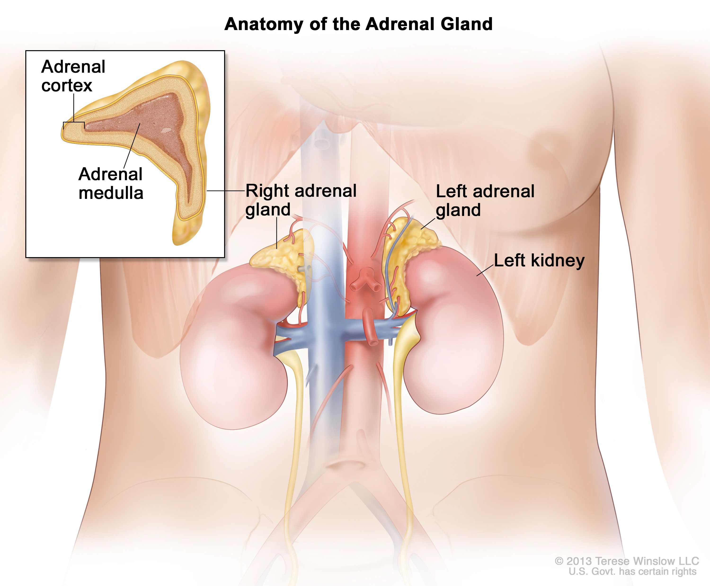

# adrenal gland (n)

/əˈdriːnl ɡlænd/ [🔊](https://www.oxfordlearnersdictionaries.com/media/english/uk_pron/a/adr/adren/adrenal_gland_1_gb_1.mp3) [🔊](https://www.oxfordlearnersdictionaries.com/media/english/us_pron/a/adr/adren/adrenal_gland_1_us_1.mp3)

a-dre-nal-gland /ə-ˈdriː-nl-ɡlænd/

also **suprarenal gland**

## 1.

### Anatomy - a small gland that makes steroid hormones, adrenaline, and noradrenaline. These hormones help control heart rate, blood pressure, and other important body functions. There are two adrenal glands, one on top of each kidney

tuyến thượng thận

