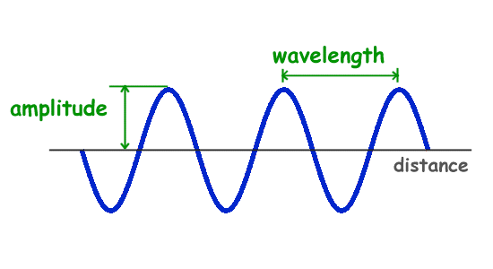

# amplitude (n)

- /ˈæmplɪtjuːd/ [🔊](https://www.oxfordlearnersdictionaries.com/media/english/uk_pron/a/amp/ampli/amplitude__gb_1.mp3)
- /ˈæmplɪtuːd/ [🔊](https://www.oxfordlearnersdictionaries.com/media/english/us_pron/a/amp/ampli/amplitude__us_1.mp3)

am-pli-tude /ˈæm-plɪ-tjuːd/

plural **amplitudes**

## 1.

### Physics - the maximum extent of a vibration or oscillation, measured from the position of equilibrium

biên độ

- In the visual system, a light wave's wavelength is generally associated with color, and its amplitude is associated with brightness.

### the maximum difference of an alternating electrical current or potential from the average value

## 2.

### Astronomy - the angular distance of a celestial object from the true east or west point of the horizon at rising  or setting

## 3.

### breadth, range, or magnitude

magnitude, size, volume, proportions, dimensions, extent, range, scope, compass, breadth, width

## 4.

### Mathematics - the angle between the real axis of an Argand diagram and a vector representing a complex number