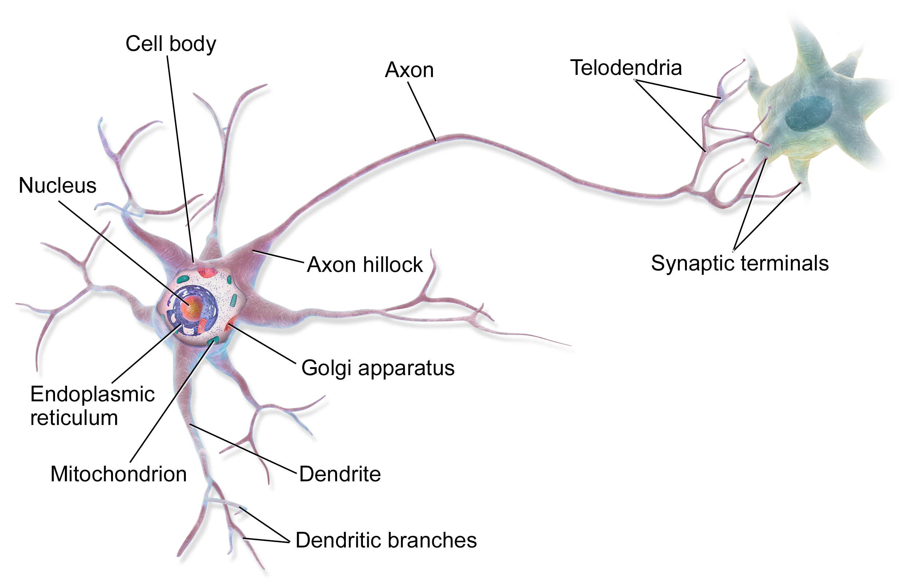
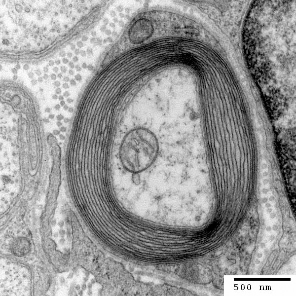

# axon (n)

- /ˈæksɒn/ [🔊](https://www.oxfordlearnersdictionaries.com/media/english/uk_pron/a/axo/axon_/axon__gb_1.mp3)
- /ˈæksɑːn/ [🔊](https://www.oxfordlearnersdictionaries.com/media/english/us_pron/a/axo/axon_/axon__us_1.mp3)

a-xon /ˈæk-sɒn/

plural **axons**

## 1.

### Psychology - the long, thin, hollow, cylindrical extension of a neuron that normally carries a nerve impulse away from the cell body. An axon often branches extensively and may be surrounded by a protective myelin sheath. Each branch of an axon ends in a terminal button (also called synaptic bouton or knob, among numerous other synonyms) from which an impulse is transmitted, through discharge of a neurotransmitter, across a synapse to a neighboring neuron.

nerve fiber

 

Cross section of an axon: (1) Axon (2) Nucleus (3) Schwann cell (4) Myelin sheath (5) Neurilemma