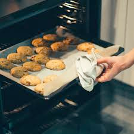

# bake (n)

/beɪk/ [🔊](https://www.oxfordlearnersdictionaries.com/media/english/uk_pron/b/bak/bake_/bake__gb_4.mp3) [🔊](https://www.oxfordlearnersdictionaries.com/media/english/us_pron/b/bak/bake_/bake__us_1.mp3)

## a disk consisting of mixed ingredients that is cooked in the oven (mẻ; đợt)

