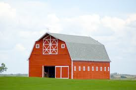
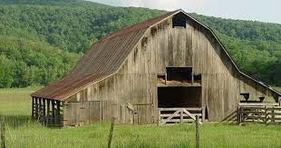

# barn (n)

- /bɑːn/ [🔊](https://www.oxfordlearnersdictionaries.com/media/english/uk_pron/b/bar/barn_/barn__gb_2.mp3)
- /bɑːrn/ [🔊](https://www.oxfordlearnersdictionaries.com/media/english/us_pron/b/bar/barn_/barn__us_1.mp3)

## (Buildings, Farming) a large farm building for storing grain or keeping animals in (kho; chuồng)

- 7 sheep are in the barn

