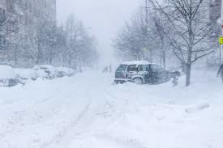
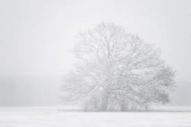

# blizzard (n)

/ˈblɪzəd/ [🔊](https://www.oxfordlearnersdictionaries.com/media/english/uk_pron/b/bli/blizz/blizzard__gb_2.mp3) [🔊](https://www.oxfordlearnersdictionaries.com/media/english/us_pron/b/bli/blizz/blizzard__us_1.mp3)

bli-zzard /ˈblɪ-zəd/

plural **blizzards**

## 1.

### a severe snowstorm with high winds and low visibility

snowstorm, snow blast, snow squall, whiteout

 

### an overabundance; a deluge

- Let's organize this blizzard of observations into a clean proof.

