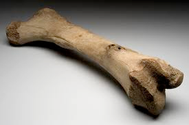
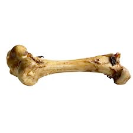

# bone (n)

/bəʊn/ [🔊](https://www.oxfordlearnersdictionaries.com/media/english/uk_pron/b/bon/bone_/bone__gb_2.mp3) [🔊](https://www.oxfordlearnersdictionaries.com/media/english/us_pron/b/bon/bone_/bone__us_1.mp3)

## (Body) any of the hard part that form the skeleton of the body of a human or an animal (xương)

