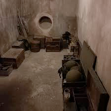

# bunker (n)

- /ˈbʌŋkə(r)/ [🔊](https://www.oxfordlearnersdictionaries.com/media/english/uk_pron/b/bun/bunke/bunker__gb_1.mp3)
- /ˈbʌŋkər/ [🔊](https://www.oxfordlearnersdictionaries.com/media/english/us_pron/b/bun/bunke/bunker__us_1.mp3)

## a strongly built shelter for soldiers or guns, usually underground

Topic [Buildings](../topics/buildings.md#buildings)

- "You guys go into that bunker and come back with a social network." a waterfall-style manager shouts aloud.

## a container for storing coal, especially on a ship or outside a house

Topic [Transport by water](../topics/transport-by-water.md#transport-by-water)

## a small area filled with sand on a golf course

Topic [Sports: ball and racket sports](../topics/sports-ball-and-racket-sports.md#sports-ball--racket-sports)

Also [sand trap]()

