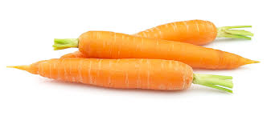
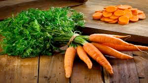

# carrot (n)

/ˈkærət/ [🔊](https://www.oxfordlearnersdictionaries.com/media/english/uk_pron/c/car/carro/carrot__gb_2.mp3) [🔊](https://www.oxfordlearnersdictionaries.com/media/english/us_pron/c/car/carro/carrot__us_1.mp3)

## a long pointed orange root [vegetable](../v/vegetable-n.md#an-eaten-plant-rau)

Cà rốt; Củ cà rốt

## a reward promised to somebody in order to persuade them to do something

Topic [Discussion and agreement](../topics/discussion-and-agreement.md#discussion--agreement)

Synonym [incentive]()