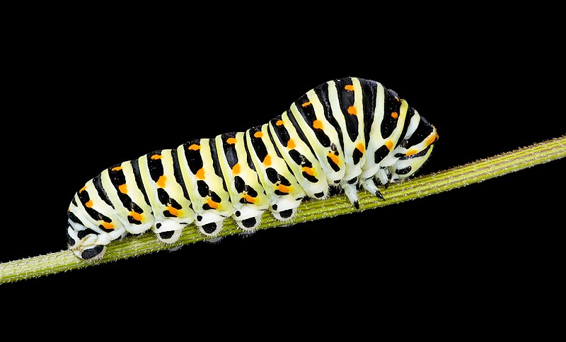
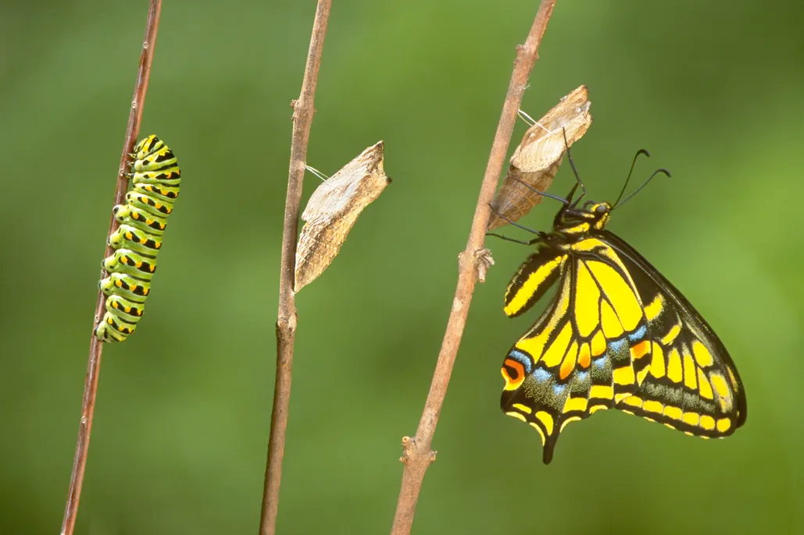

# caterpillar (n)

- /ˈkætəpɪlə(r)/ [🔊](https://www.oxfordlearnersdictionaries.com/media/english/uk_pron/c/cat/cater/caterpillar__gb_1.mp3)
- /ˈkætərpɪlər/ [🔊](https://www.oxfordlearnersdictionaries.com/media/english/us_pron/c/cat/cater/caterpillar__us_1_rr.mp3)

## a small creature like a worm with legs that develops into a butterfly or moth. Caterpillars eat the leaves of plants. (sâu bướm)

