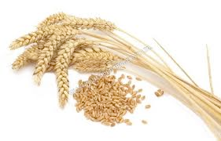
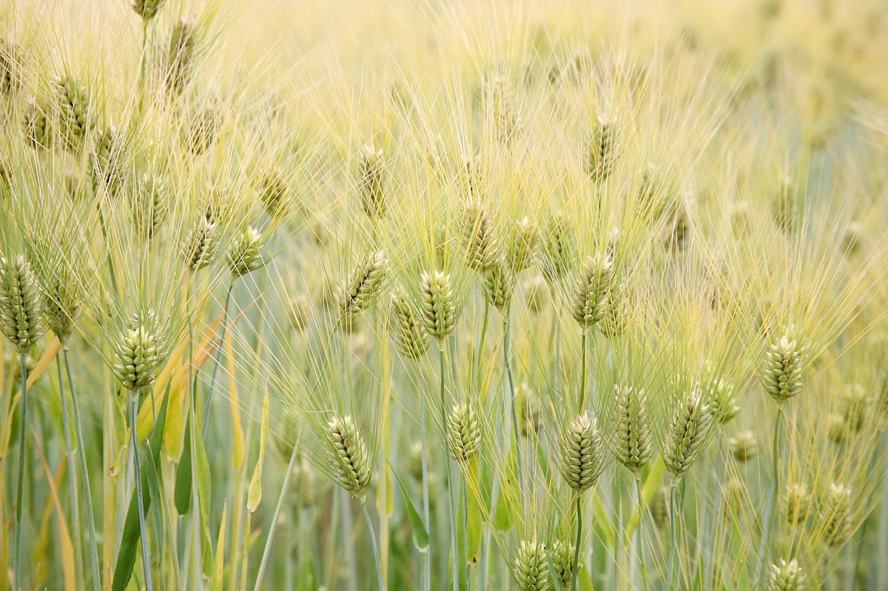
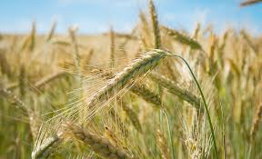

# cereal (n)

- /ˈsɪəriəl/ [🔊](https://www.oxfordlearnersdictionaries.com/media/english/uk_pron/c/cer/cerea/cereal__gb_2.mp3)
- /ˈsɪriəl/ [🔊](https://www.oxfordlearnersdictionaries.com/media/english/us_pron/c/cer/cerea/cereal__us_1.mp3)

## (Farming) one of various types of grass that produce grains that can be eaten or are used to make flour or bread; wheat, barley, and rye are all cereals (ngũ cốc)

- wheat

- barley

- rye
