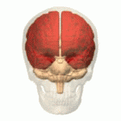

# cerebrum (n)

- /səˈriːbrəm/ [🔊](https://www.oxfordlearnersdictionaries.com/media/english/uk_pron/c/cer/cereb/cerebrum__gb_1.mp3) [🔊](https://www.oxfordlearnersdictionaries.com/media/english/us_pron/c/cer/cereb/cerebrum__us_1_rr.mp3)
- /ˈserəbrəm/ [🔊](https://www.oxfordlearnersdictionaries.com/media/english/uk_pron/c/cer/cereb/cerebrum__gb_2.mp3) [🔊](https://www.oxfordlearnersdictionaries.com/media/english/us_pron/c/cer/cereb/cerebrum__us_2_rr.mp3)

ce-re-brum /sə-ˈriː-brəm/

plural **cerebra** /səˈriːbrə/ [🔊](https://www.oxfordlearnersdictionaries.com/media/english/uk_pron/c/cer/cereb/cerebra__gb_1.mp3) [🔊](https://www.oxfordlearnersdictionaries.com/media/english/us_pron/c/cer/cereb/cerebra__us_1.mp3) /ˈserəbrə/ [🔊](https://www.oxfordlearnersdictionaries.com/media/english/uk_pron/c/cer/cereb/cerebra__gb_2.mp3) [🔊](https://www.oxfordlearnersdictionaries.com/media/english/us_pron/c/cer/cereb/cerebra__us_2.mp3)

## 1.

### Anatomy - the principal and most anterior part of the brain in vertebrates, located in the front area of the skull and consisting of two hemispheres, left and right, separated by a fissure. It is responsible for the integration of complex sensory and neural functions and the initiation and coordination of voluntary activity in the body

đại não

 (the red part)