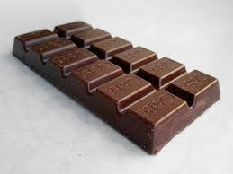
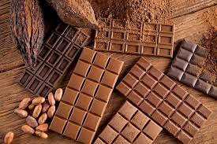
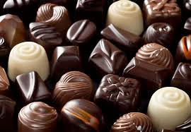

# chocolate (n)

- /ˈtʃɒklət/ [🔊](https://www.oxfordlearnersdictionaries.com/media/english/uk_pron/c/cho/choco/chocolate__gb_2.mp3)
- /ˈtʃɔːklət/ [🔊](https://www.oxfordlearnersdictionaries.com/media/english/us_pron/c/cho/choco/chocolate__us_2_rr.mp3)

## (Food) (uncountable) a hard brown sweet food made from cocoa beans, used in cooking to add taste to cakes, etc. or eaten as a sweet (sô cô la)

