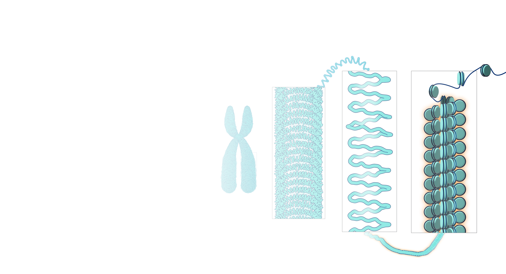
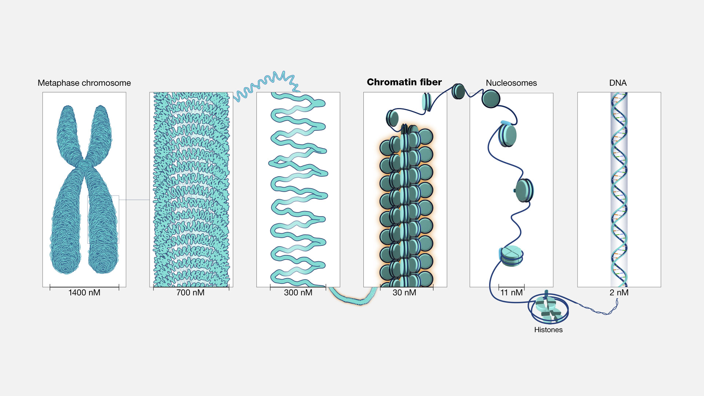

# chromatin (n)

## 1.

### Biology - the material (a substance) of which the chromosomes of organisms other than bacteria (i.e., eukaryotes) are composed. It consists of protein (nucleoprotein), RNA, and DNA

- Chromatin refers to a mixture of DNA and proteins that form the chromosomes found in the cells of humans and other higher organisms. Many of the proteins — namely, histones — package the massive amount of DNA in a genome into a highly compact form that can fit in the cell nucleus. 