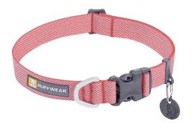

# collar (n)

- /ˈkɒlə(r)/ [🔊](https://www.oxfordlearnersdictionaries.com/media/english/uk_pron/c/col/colla/collar__gb_1.mp3)
- /ˈkɑːlər/ [🔊](https://www.oxfordlearnersdictionaries.com/media/english/us_pron/c/col/colla/collar__us_1.mp3)

## a band of leather or plastic put around the neck of an animal, especially a dog (vòng cổ; xích cổ)

