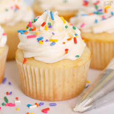

# cupcake (n)

/ˈkʌpkeɪk/ [🔊](https://www.oxfordlearnersdictionaries.com/media/english/uk_pron/c/cup/cupca/cupcake__gb_1.mp3) [🔊](https://www.oxfordlearnersdictionaries.com/media/english/us_pron/c/cup/cupca/cupcake__us_1.mp3)

## (Food) a small cake, baked in a paper container that is like a cup in shape and often with icing on top (bánh nướng nhỏ)

