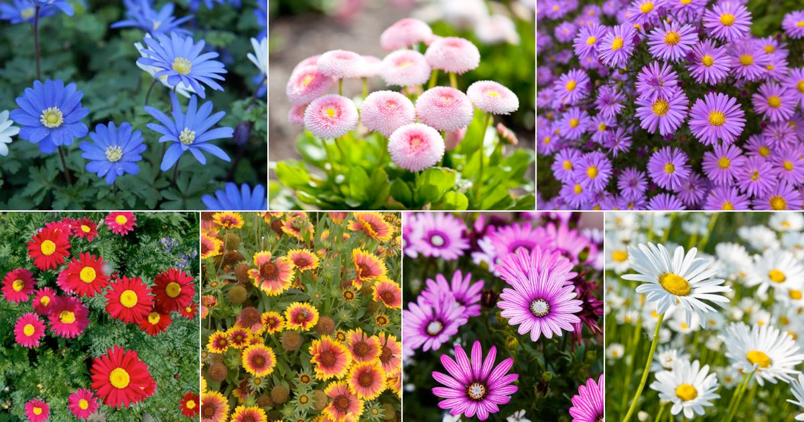

# daisy (n)

/ˈdeɪzi/ [🔊](https://www.oxfordlearnersdictionaries.com/media/english/uk_pron/d/dai/daisy/daisy__gb_1.mp3) [🔊](https://www.oxfordlearnersdictionaries.com/media/english/us_pron/d/dai/daisy/daisy__us_1.mp3)

## (Plants and trees) a small wild flower with white petals around a yellow center; a taller plant with similar but larger flowers (hoa cúc)

