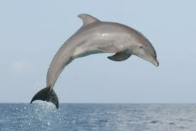

# dolphin (n)

- /ˈdɒlfɪn/ [🔊](https://www.oxfordlearnersdictionaries.com/media/english/uk_pron/p/pen/pengu/penguin__gb_3.mp3)
- /ˈdɑːlfɪn/ [🔊](https://www.oxfordlearnersdictionaries.com/media/english/uk_pron/p/pen/pengu/penguin__gb_3.mp3)

## (Animals) a sea animal (a mammal) that looks like a large fish with a pointed mouth. Dolphins are very intelligent and often friendly towards humans. There are several types of dolphin (cá heo)

