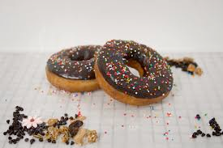
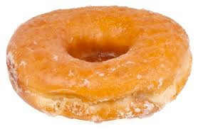

# donut (n)

/ˈdəʊnʌt/ [🔊](https://www.oxfordlearnersdictionaries.com/media/english/uk_pron/d/dou/dough/doughnut__gb_1.mp3) [🔊](https://www.oxfordlearnersdictionaries.com/media/english/us_pron/d/dou/dough/doughnut__us_1.mp3)

## (Food) a small cake made by fried dough, usually in the shape of a ring, or round and filled with jam, fruit, cream, etc. (bánh vòng; bánh donut)

