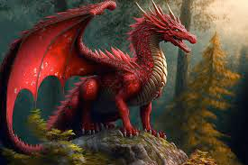
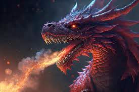
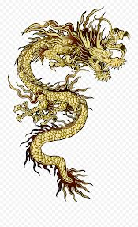

# dragon (n)

/ˈdræɡən/ [🔊](https://www.oxfordlearnersdictionaries.com/media/english/uk_pron/d/dra/drago/dragon__gb_2.mp3) [🔊](https://www.oxfordlearnersdictionaries.com/media/english/us_pron/d/dra/drago/dragon__us_1.mp3)

## (in stories) a large, aggressive animal, with wings and a long tail, that can breathe out fire (con rồng)

