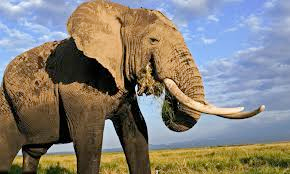
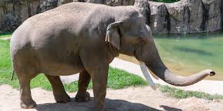

# elephant (n)

/ˈelɪfənt/ [🔊](https://www.oxfordlearnersdictionaries.com/media/english/uk_pron/e/ele/eleph/elephant__gb_1.mp3) [🔊](https://www.oxfordlearnersdictionaries.com/media/english/us_pron/e/ele/eleph/elephant__us_1.mp3)

## (Animals) a very large animal with thick grey skin, large ears, two curved outer teeth called tusks and a long nose called a trunk. There are two types of elephant, the African and Asian. (con voi)

