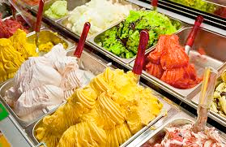

# gelato (n)

- /dʒəˈlɑː.təʊ/ [🔊](https://dictionary.cambridge.org/media/english/uk_pron/c/cdo/cdo03/cdo0319ukgela0697.mp3)
-  /dʒəˈlɑː.t̬oʊ/ [🔊](https://dictionary.cambridge.org/media/english/us_pron/c/cdo/cdo11/cdo1119usgela0518.mp3)

plural [gelati]() or [gelatos]()

ge-la-to /dʒə-ˈlɑː.-təʊ/

## the Italian style of ice-cream made from milk, cream, sugar, and fruit or other favours mixed together and frozen

một loại kem Ý

