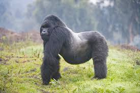

# gorilla (n)

/ɡəˈrɪlə/ [🔊](https://www.oxfordlearnersdictionaries.com/media/english/uk_pron/g/gor/goril/gorilla__gb_1.mp3) [🔊](https://www.oxfordlearnersdictionaries.com/media/english/us_pron/g/gor/goril/gorilla__us_1.mp3)

## (Animals) a very large powerful African ape (an animal like a large monkey without a tail) (khỉ đột)

