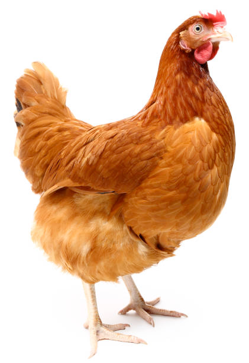
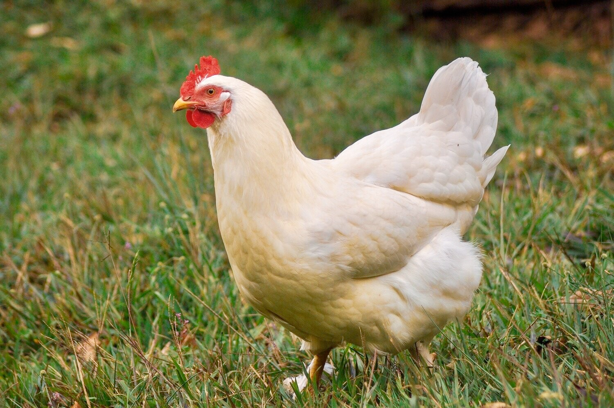

# hen (n)

- /hen/ [🔊](https://www.oxfordlearnersdictionaries.com/media/english/uk_pron/h/hen/hen__/hen__gb_1.mp3) [🔊](https://www.oxfordlearnersdictionaries.com/media/english/us_pron/h/hen/hen__/hen__us_1.mp3)

## (Birds) a female chicken, often kept for its eggs or meat (gà mái)

## (Birds) a female bird (chim mái)