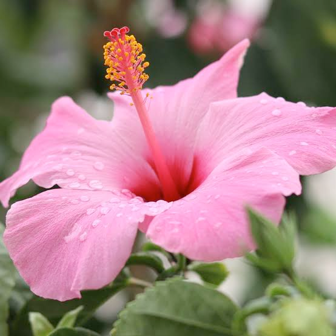
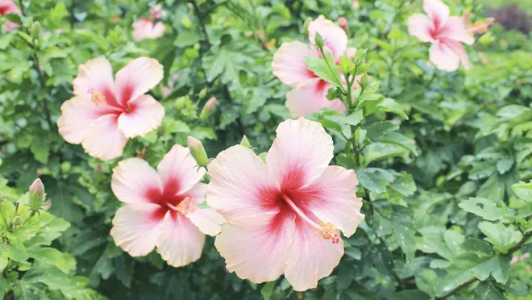
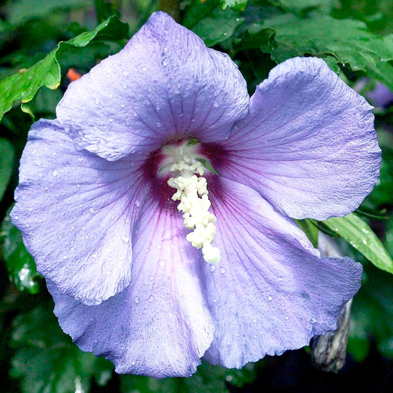

# hibiscus (n)

- /hɪˈbɪskəs/ [🔊](https://www.oxfordlearnersdictionaries.com/media/english/uk_pron/h/hib/hibis/hibiscus__gb_1.mp3) [🔊](https://www.oxfordlearnersdictionaries.com/media/english/us_pron/h/hib/hibis/hibiscus__us_1_rr.mp3)
- /haɪˈbɪskəs/ [🔊](https://www.oxfordlearnersdictionaries.com/media/english/uk_pron/h/hib/hibis/hibiscus__gb_2.mp3) [🔊](https://www.oxfordlearnersdictionaries.com/media/english/us_pron/h/hib/hibis/hibiscus__us_2_rr.mp3)

hi-bis-cus /hɪ-ˈbɪs-kəs/

plural **hibiscuses**

## 1.

### a plant of the mallow family, grown in warm climates for its large brightly coloured flowers or for products such as fiber or timber

cây bụp giấm, atiso đỏ, lạc thần hoa, đay nhật

  