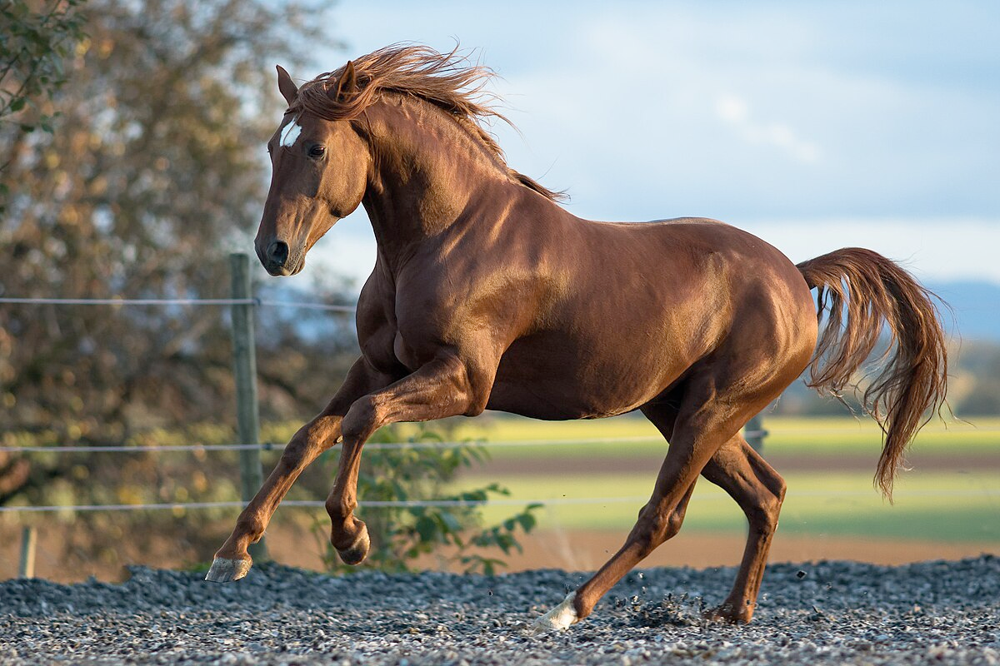

# horse (n)

- /hɔːs/ [🔊](https://www.oxfordlearnersdictionaries.com/media/english/uk_pron/h/hor/horse/horse__gb_1.mp3)
- /hɔːrs/ [🔊](https://www.oxfordlearnersdictionaries.com/media/english/us_pron/h/hor/horse/horse__us_1.mp3)

## (Animals) a large animal with four legs, a mane and a tail. Horses are used for riding on, pulling carriages, etc. (con ngựa)

