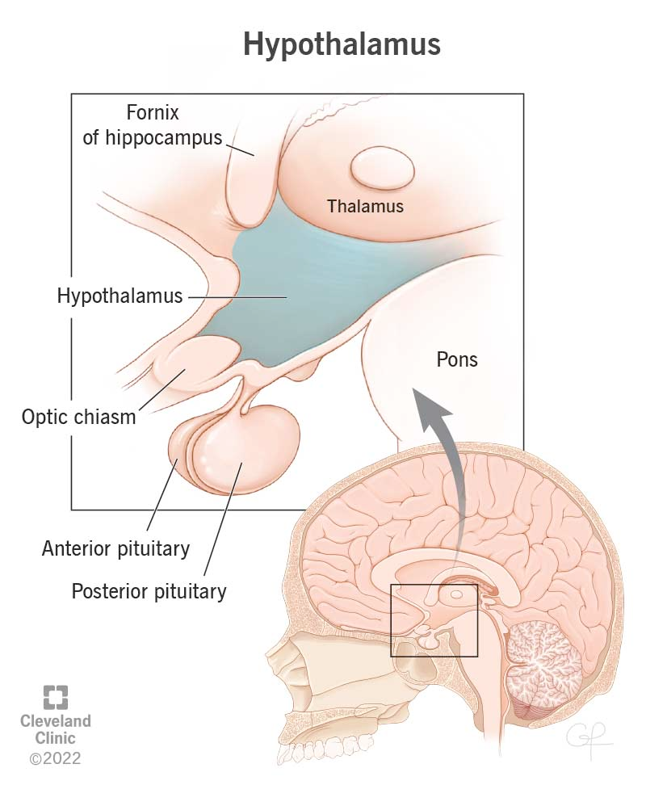

# hypothalamus (n)

/ˌhaɪpəˈθæləməs/ [🔊](https://www.oxfordlearnersdictionaries.com/media/english/uk_pron/h/hyp/hypot/hypothalamus__gb_1.mp3) [🔊](https://www.oxfordlearnersdictionaries.com/media/english/us_pron/h/hyp/hypot/hypothalamus__us_1.mp3)

hy-po-tha-la-mus /ˌhaɪ-pə-ˈθæ-lə-məs/

## 1.

### a region of the forebrain below thalamus which coordinates both the autonomic nervous system and the activity of the pituitary, controlling body temperature, hunger, and thirst

- The hypothalamus serves as the interface between the nervous system and the endocrine system, and it controls the secretions of the pituitary.