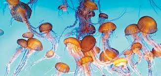
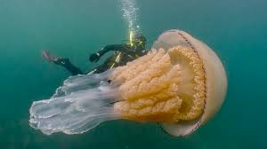

# jellyfish (n)

/ˈdʒelifɪʃ/ [🔊](https://www.oxfordlearnersdictionaries.com/media/english/uk_pron/j/jel/jelly/jellyfish__gb_1.mp3) [🔊](https://www.oxfordlearnersdictionaries.com/media/english/us_pron/j/jel/jelly/jellyfish__us_1.mp3)

Plural [jellyfish]()

## (Fish and shellfish) a sea creature with a body like jelly and long thin parts called tentacles that can give a sharp sting (con sứa)

