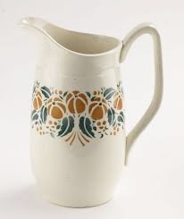
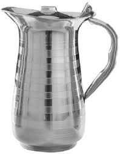
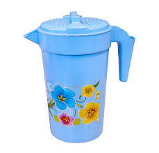
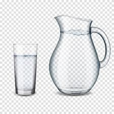

# jug (n)

/dʒʌɡ/ [🔊](https://www.oxfordlearnersdictionaries.com/media/english/uk_pron/j/jug/jug__/jug__gb_1.mp3) [🔊](https://www.oxfordlearnersdictionaries.com/media/english/us_pron/j/jug/jug__/jug__us_1.mp3)

plural **jugs**

## 1.

### North American - a large container for liquids, with a narrow mouth and typically a stopper or cap

pitcher, ewer, crock, jar, urn, carafe, flask, flagon, decanter, vessel, receptacle, container, toby jug, creamer, amphora, jorum, graybeard

   

- Suppose that we have water jugs with capacities `a` and `b` with `b >= a`.

### British - a cylindrical container with a handle and a lip, used for holding and pouring liquids

### the contents of a jug

## 2.

### Informal - prison

## 3.

### Vulgar slang - a woman's breasts

## 4.

### Climbing - a secure hold that is cut into rock for climbing

