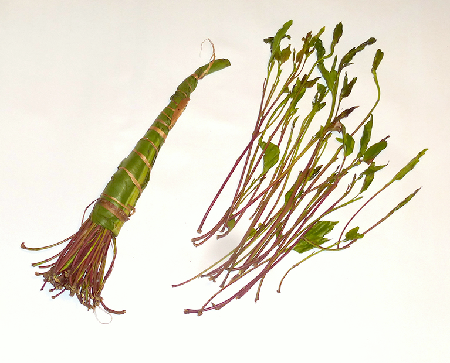

# khat (n)

/kɑːt/ [🔊](https://www.oxfordlearnersdictionaries.com/media/english/uk_pron/k/kha/khat_/khat__gb_2.mp3) [🔊](https://www.oxfordlearnersdictionaries.com/media/english/us_pron/k/kha/khat_/khat__us_1.mp3)

also **qat**

plural **khats**, **qats**

## 1.

### the leaves of an Arabian shrub, which are chewed (or drunk as an infusion) as a stimulant

 

- Khat is a flowering evergreen shrub that is abused for its stimulant-like effect. Khat has two active ingredients, cathine and [cathinone](../c/cathinone-n.md#a-stimulus-substance-c9h11no-found-in-khat).

## 2.

### the shrub that produces khat, growing in mountainous regions and often cultivated 