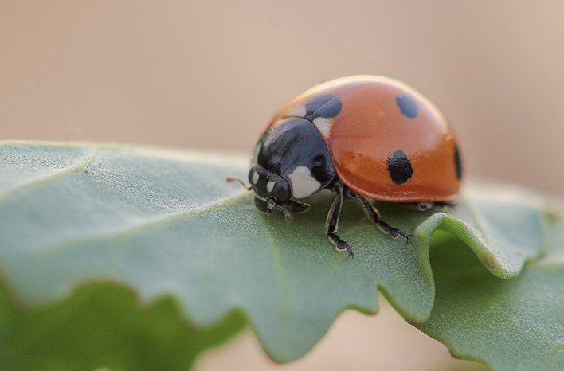

# ladybug (n)

/ˈleɪdibʌɡ/ [🔊](https://www.oxfordlearnersdictionaries.com/media/english/uk_pron/l/lad/ladyb/ladybug__gb_1.mp3) [🔊](https://www.oxfordlearnersdictionaries.com/media/english/us_pron/l/lad/ladyb/ladybug__us_1.mp3)

## (Insects, worms, etc.) a small flying insect, usually red with black spots (bọ rùa; cánh cam)

