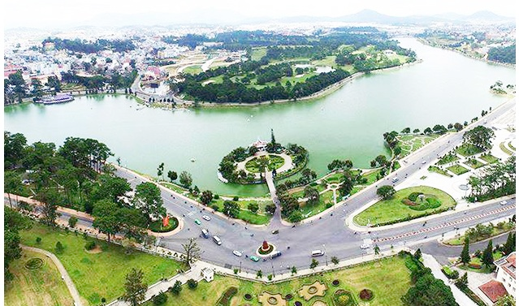
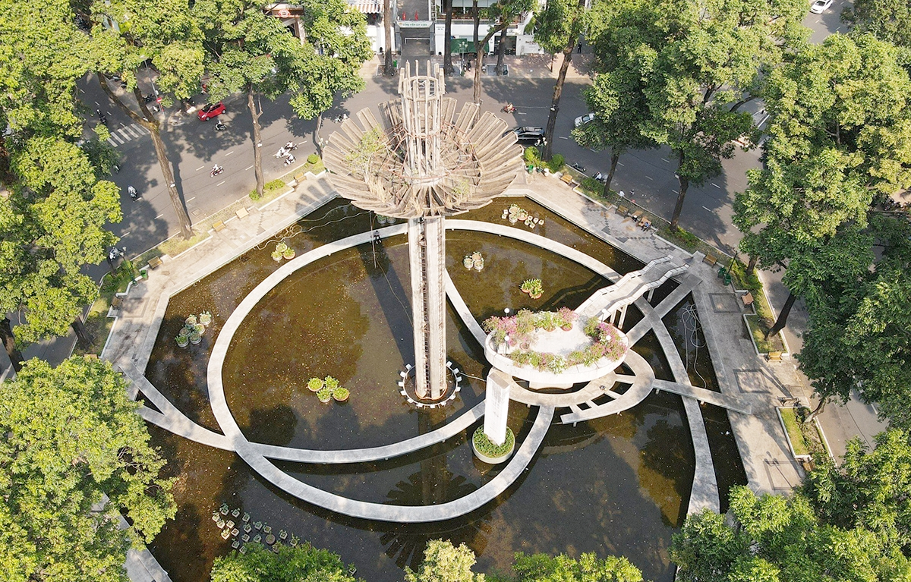
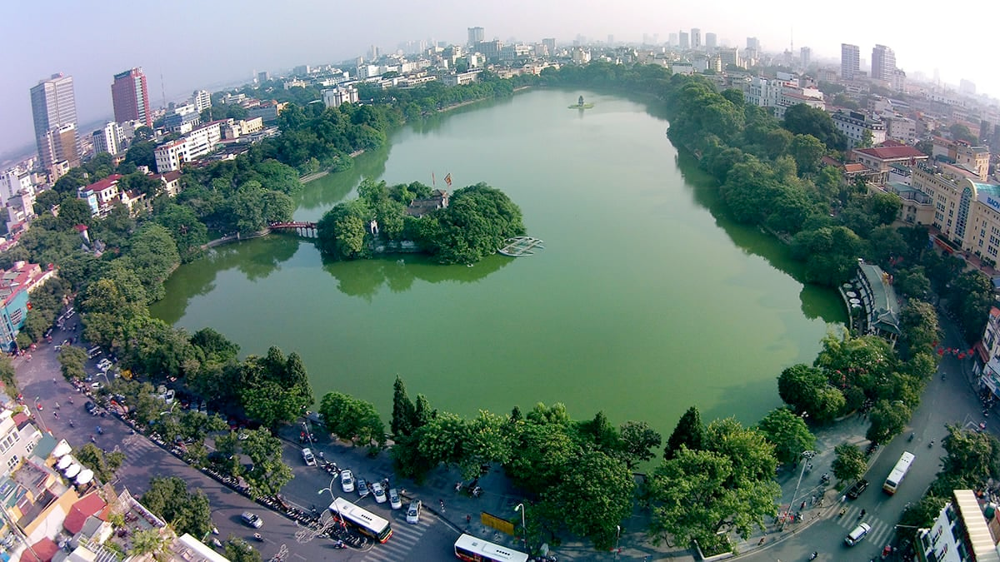

# lake (n)

/leɪk/ [🔊](https://www.oxfordlearnersdictionaries.com/media/english/uk_pron/l/lak/lake_/lake__gb_1.mp3) [🔊](https://www.oxfordlearnersdictionaries.com/media/english/us_pron/l/lak/lake_/lake__us_1.mp3)

## (Geography) a large area of water that is surrounded by land (hồ)

- The Xuan Huong lake (Da Lat)

- The Turtle lake (Sai Gon)

- The Sword-Returned lake (Ha Noi)
