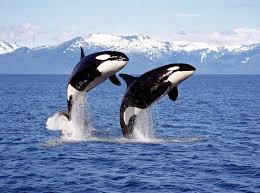
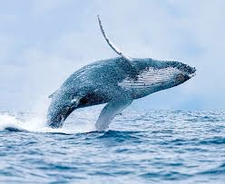

# leap (v)

/liːp/ [🔊](https://www.oxfordlearnersdictionaries.com/media/english/uk_pron/l/lea/leap_/leap__gb_1.mp3) [🔊](https://www.oxfordlearnersdictionaries.com/media/english/us_pron/l/lea/leap_/leap__us_1.mp3)

## to jump high or a long way (nhảy cao/xa)

- Two dolphins are leaping

- The whale is leaping.