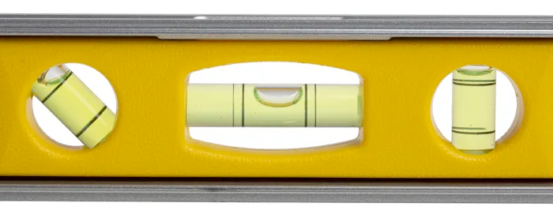

# level (n)

/ˈlevl/ [🔊](https://www.oxfordlearnersdictionaries.com/media/english/uk_pron/l/lev/level/level__gb_2.mp3) [🔊](https://www.oxfordlearnersdictionaries.com/media/english/us_pron/l/lev/level/level__us_2.mp3)

le-vel

## the height of something in relation to the ground or to what it used to be

độ cao so với mặt đất; mực nước; mức

- ground level
- lowest level
- the level rose/dropped/decreased/increased
- on a level (cùng chiều cao)
  - on a level with something

## a floor of a building; a layer of ground

Topic [Houses and homes](../topics/houses-and-homes.md#houses--homes)

tầng

- lowest level
- on the level
- to Level #

## the amount of something that exists in a particular situation at a particular time

mức; mức độ

- level of support
- level of something
  - the current level of something
  - increase one's level of something
  - to raise/reduce/achieve the level of something
- energy levels
- at a/the ... level
  - at the same level as

## a particular standard or quality

trình độ

- level of service
- to maintain ... level of something
- at a ... level
- on a level
- sink to one's level

## a position or rank in a scale of size or importance

bậc; tầm; mức, mức độ; cấp, cấp độ

- at a ... level
- at local/international level

## a particular way of looking at, reacting to or understanding something

mức, mức độ

- on a ... level
- at a ... level

## one of a series of stages in a computer game. Players progress from easy to more advanced levels within the game

màn; trình độ; mức, mức độ; cấp, cấp độ

## a device used to test whether a surface is level, consisting a glass tube partly filled with liquid with a bubble of air inside. The position of the bubble indicated whether the surface is level.

