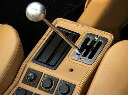
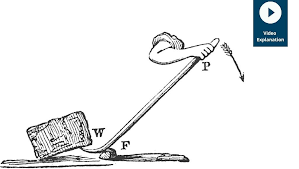

# lever (n)

- /ˈliːvə(r)/ [🔊](https://www.oxfordlearnersdictionaries.com/media/english/uk_pron/l/lev/lever/lever__gb_1.mp3)
- /ˈlevər/ [🔊](https://www.oxfordlearnersdictionaries.com/media/english/us_pron/l/lev/lever/lever__us_1_rr.mp3)

## a handle used to operate a vehicle or a machine

Topic [Engineering](../topics/engineering.md#engineering)

Cần gạt

## a long piece of wood, metal, etc. used for lifting or opening something by somebody placing one end of it under an object and pushing down on the other end

Đòn bẩy

## an action that is used to put pressure on somebody to do something they do not want to do

Đòn bẩy; Sự thúc đẩy

- Find the right levers to move people into that maximize rewards state