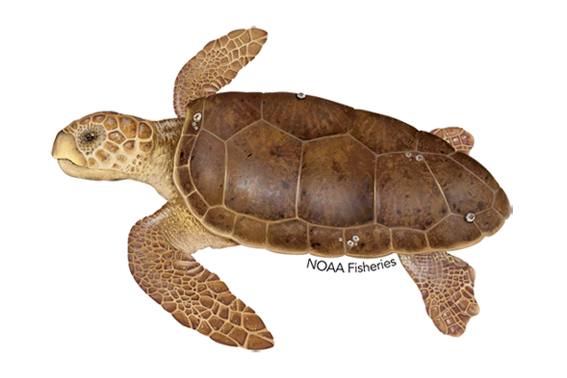
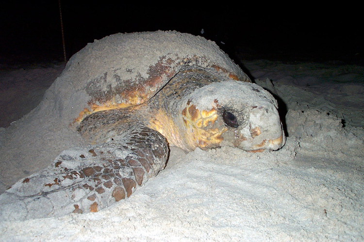
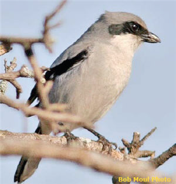
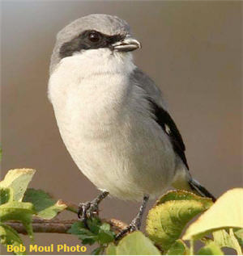

# loggerhead (n)

- /ˈlɒɡəhed/ [🔊](https://dictionary.cambridge.org/media/english/uk_pron/e/epd/epd17/epd17503.mp3)
- /ˈlɔːɡərhed/ [🔊](https://dictionary.cambridge.org/media/english/us_pron/c/cdo/cdo03/cdo0318uslogg2781.mp3)

lo-gger-head /ˈlɒ-ɡə-hed/

also **loggerhead sea turtle**, **loggerhead turtle**, **loggerhead shrike**

plural **loggerheads**, **loggerhead sea turtles**, **loggerhead turtles**, **loggerhead shrikes**

## 1.

### a reddish-brown turtle with a very large head, occurring chiefly in warm sea

 

### a widespread North American shrike, having mainly grey plumage with a black eyestripe, wings, and tail

 