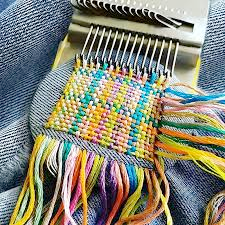
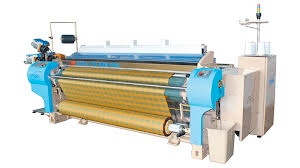

# loom (n)

/luːm/ [🔊](https://www.oxfordlearnersdictionaries.com/media/english/uk_pron/l/loo/loom_/loom__gb_1.mp3) [🔊](https://www.oxfordlearnersdictionaries.com/media/english/us_pron/l/loo/loom_/loom__us_1.mp3)

## a machine for making cloth by crossing threads over and under other threads that go in a different directions

Máy dệt

