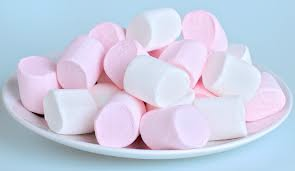

# marshmallow (n)

- /ˌmɑːʃˈmæləʊ/ [🔊](https://www.oxfordlearnersdictionaries.com/media/english/uk_pron/m/mar/marsh/marshmallow__gb_1.mp3)
- /ˈmɑːrʃmeləʊ/ [🔊](https://www.oxfordlearnersdictionaries.com/media/english/us_pron/m/mar/marsh/marshmallow__us_1.mp3)

## (Food) a pink or white sweet that feels soft and elastic when you bite it (kẹo dẻo/xốp)

