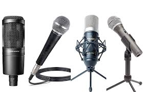

# microphone (n)

/ˈmaɪkrəfəʊn/ [🔊](https://www.oxfordlearnersdictionaries.com/media/english/uk_pron/m/mic/micro/microphone__gb_1.mp3) [🔊](https://www.oxfordlearnersdictionaries.com/media/english/us_pron/m/mic/micro/microphone__us_1.mp3)

Informal [mic]() or [mike]()

## (Music) a device that is used for recording sounds or for making your voice louder when you are speaking or singing to an audience (cái mic; cái mi crô)

