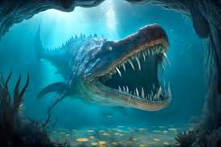
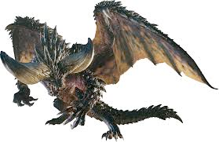

# monster (n)

- /ˈmɒnstə(r)/ [🔊](https://www.oxfordlearnersdictionaries.com/media/english/uk_pron/m/mon/monst/monster__gb_2.mp3)
- /ˈmɑːnstər/ [🔊](https://www.oxfordlearnersdictionaries.com/media/english/uk_pron/r/rea/real_/real__gb_2.mp3)

## (Story) an imaginary creature that is very large, ugly, and frightening (quái vật; yêu quái)

- sea monsters

