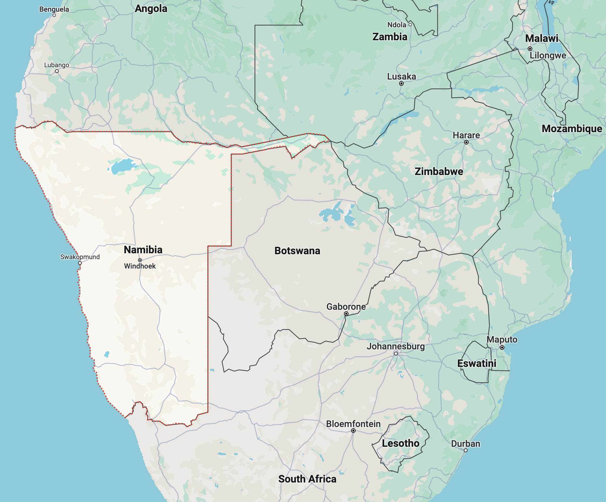

# Namibia (n)

/nəˈmɪbiə/ [🔊](https://www.oxfordlearnersdictionaries.com/media/english/uk_pron/n/nam/namib/namibia_1_gb_5.mp3) [🔊](https://www.oxfordlearnersdictionaries.com/media/english/us_pron/n/nam/namib/namibia_1_us_2.mp3)

na-mi-bi-a /nə-ˈmɪ-bi-ə/

## 1.

### Republic of Namibia, a country in Southern Africa

