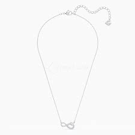

# necklace (n)

/ˈnekləs/ [🔊](https://www.oxfordlearnersdictionaries.com/media/english/uk_pron/n/nec/neckl/necklace__gb_1.mp3) [🔊](https://www.oxfordlearnersdictionaries.com/media/english/us_pron/n/nec/neckl/necklace__us_1.mp3)

## (Clothes and fashion) a piece of jewellery consisting of a chain, string of beads, etc. worn around the neck (vòng cổ/kiềng; chuỗi; dây chuyền)

