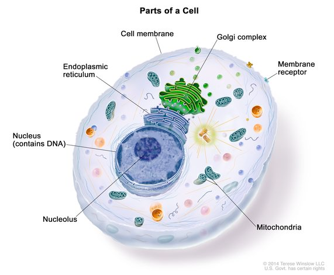

# nucleus (n)

- /ˈnjuːkliəs/ [🔊](https://www.oxfordlearnersdictionaries.com/media/english/uk_pron/h/hyp/hypot/hypothalamus__gb_1.mp3)
- /ˈnuːkliəs/ [🔊](https://www.oxfordlearnersdictionaries.com/media/english/uk_pron/h/hyp/hypot/hypothalamus__gb_1.mp3)

plural **nuclei** /ˈnjuːkliaɪ/ [🔊](https://www.oxfordlearnersdictionaries.com/media/english/uk_pron/h/hyp/hypot/hypothalamus__gb_1.mp3) /ˈnuːkliaɪ/ [🔊](https://www.oxfordlearnersdictionaries.com/media/english/uk_pron/h/hyp/hypot/hypothalamus__gb_1.mp3)

## 1.

### Biology - the structure in a cell that contains the chromosomes. The nucleus has membrane around it, and is where RNA is made from DNA in the chromosomes.

