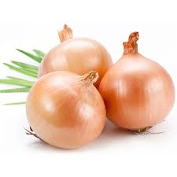
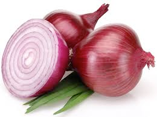

# onion (n)

/ˈʌnjən/ [🔊](https://www.oxfordlearnersdictionaries.com/media/english/uk_pron/o/oni/onion/onion__gb_2.mp3) [🔊](https://www.oxfordlearnersdictionaries.com/media/english/us_pron/o/oni/onion/onion__us_1.mp3)

## (Food) a round vegetable with many layers inside each other and a brown, red, or white skin. Onions have a strong smell and taste (củ hành tây)

