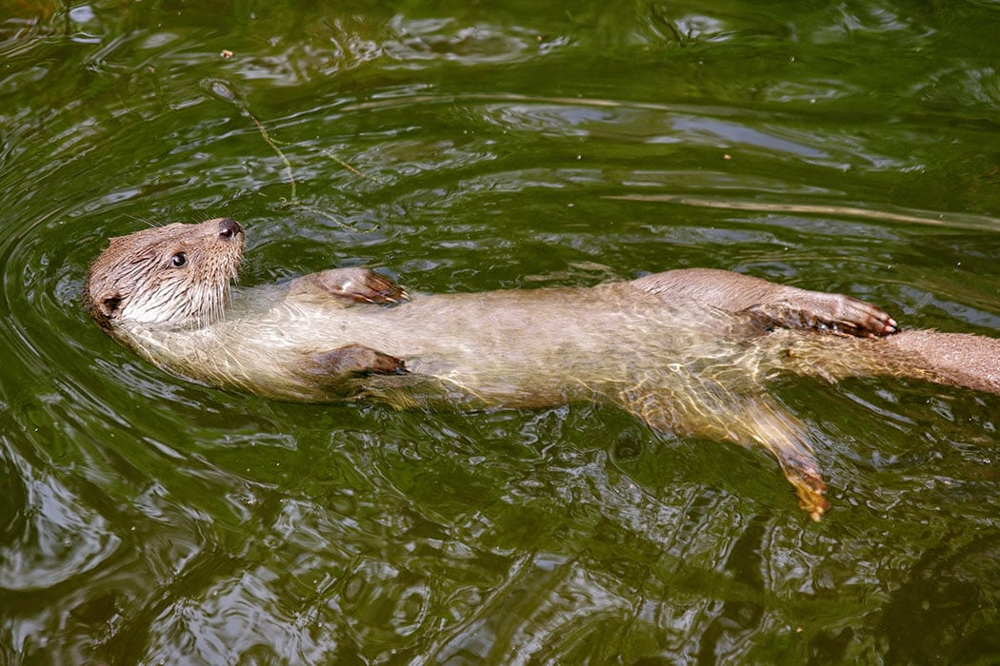

# otter (n)

- /ˈɒtə(r)/ [🔊](https://www.oxfordlearnersdictionaries.com/media/english/uk_pron/o/ott/otter/otter__gb_1.mp3)
- /ˈɑːtər/ [🔊](https://www.oxfordlearnersdictionaries.com/media/english/us_pron/o/ott/otter/otter__us_1.mp3)

## (Animals) a small animal that has four webbed feet, a tail and thick brown fur. Otters live in rivers and eat fish. (rái cá)

