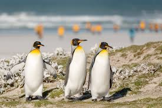
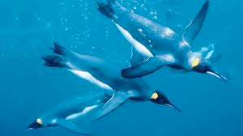

# penguin (n)

/ˈpeŋɡwɪn/ [🔊](https://www.oxfordlearnersdictionaries.com/media/english/uk_pron/p/pen/pengu/penguin__gb_3.mp3) [🔊](https://www.oxfordlearnersdictionaries.com/media/english/us_pron/p/pen/pengu/penguin__us_1.mp3)

## a black and white bird that lives in the Antarctic. Penguins cannot fly but use their wings for swimming. There are several types of penguin, some of them very large but some of them quite small (chim cánh cụt)

