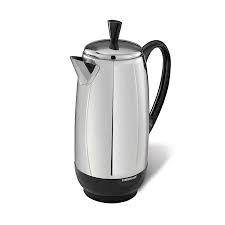
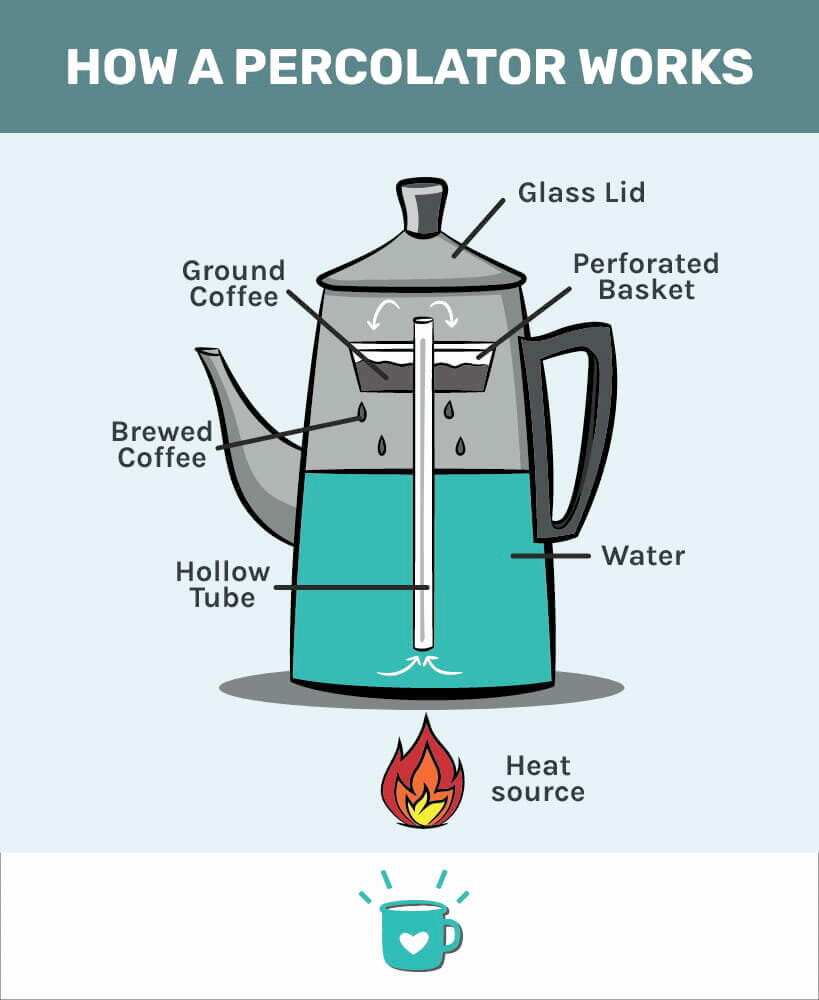

# percolator (n)

- /ˈpɜːkəleɪtə(r)/ [🔊](https://www.oxfordlearnersdictionaries.com/media/english/uk_pron/p/per/perco/percolator__gb_1.mp3)
- /ˈpɜːrkəleɪtər/ [🔊](https://www.oxfordlearnersdictionaries.com/media/english/us_pron/p/per/perco/percolator__us_1.mp3)

## a pot for making coffee, in which boiling water is forced up a central tube and then comes down again through the coffee

Bình/ấm pha cà phê

