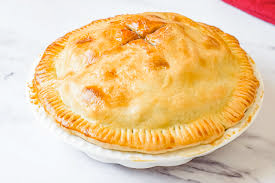

# pie (n)

/paɪ/ [🔊](https://www.oxfordlearnersdictionaries.com/media/english/uk_pron/p/pie/pie__/pie__gb_1.mp3) [🔊](https://www.oxfordlearnersdictionaries.com/media/english/us_pron/p/pie/pie__/pie__us_1.mp3)

## (Food) a baked disk of fruit or meat and/or vegetables with pastry on the bottom, sides, and top (bánh; bánh nướng)

- apple pie

- chocolate pie

