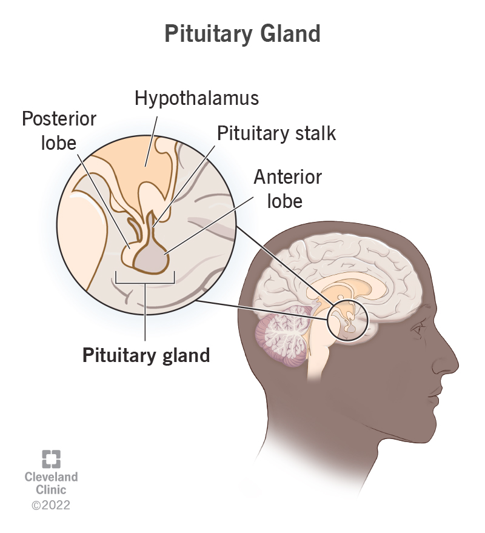

# pituitary (n)

- /pɪˈtjuːɪtəri/ [🔊](https://www.oxfordlearnersdictionaries.com/media/english/uk_pron/p/pit/pitui/pituitary__gb_1.mp3)
- /pɪˈtuːəteri/ [🔊](https://www.oxfordlearnersdictionaries.com/media/english/us_pron/p/pit/pitui/pituitary__us_1.mp3)

pi-tu-i-ta-ry /pɪ-ˈtjuː-ɪ-tə-ri/

also **pituitary gland**

## 1.

### Biology - a pea-sized organ attached to the part of the brain called the [hypothalamus](../h/hypothalamus-n.md#a-region-of-the-forebrain-below-thalamus-which-coordinates-both-the-autonomic-nervous-system-and-the-activity-of-the-pituitary-controlling-body-temperature-hunger-and-thirst). It lies at the base of the brain above the back of the nose. The hypothalamus sends signals to the pituitary gland, which then makes hormones that control other glands and many of the body's functions, including growth and fertility.

tuyến yên

- The pituitary serves as the master gland, controlling the secretions of all other glands.