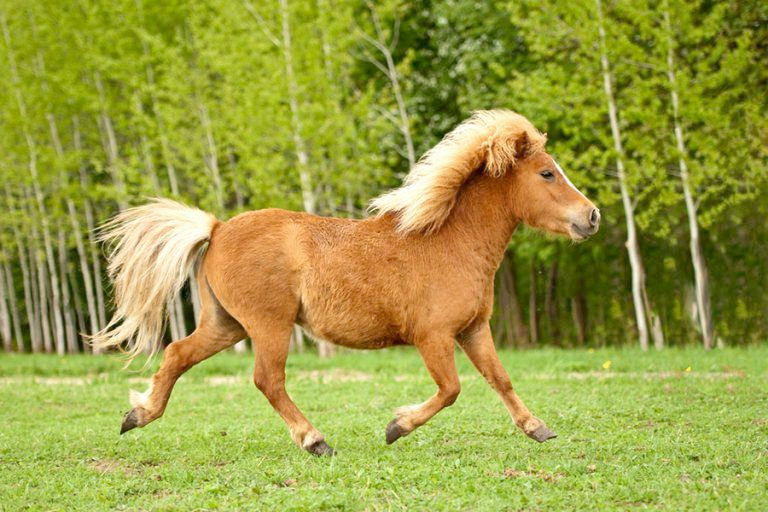

# pony (n)

/ˈpəʊni/ [🔊](https://www.oxfordlearnersdictionaries.com/media/english/uk_pron/p/pon/pony_/pony__gb_1.mp3) [🔊](https://www.oxfordlearnersdictionaries.com/media/english/us_pron/p/pon/pony_/pony__us_1.mp3)

## (Animals) a type of small horse (ngựa nhỏ; giống ngựa Pony)

- How do we count the ponies